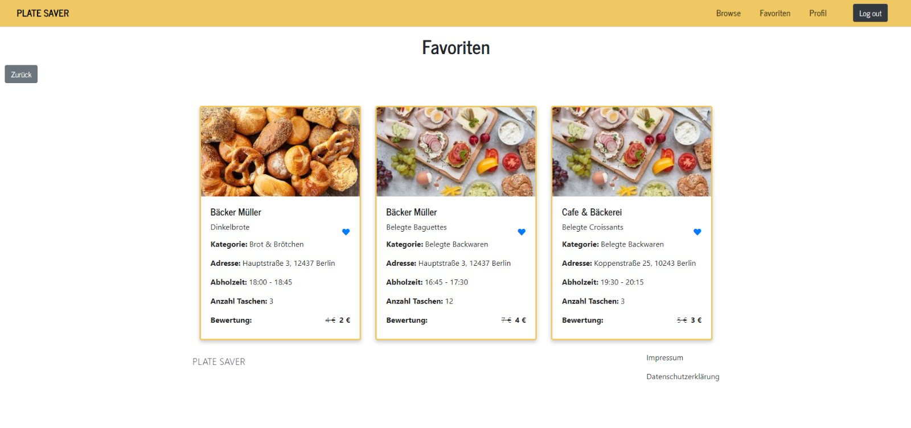

{: .no_toc }
# Reference dokumentation

<details open markdown="block">
{: .text-delta }
<summary>Table of contents</summary>
+ ToC
{: toc }
</details>

## [Section / module]

## 01: favourites Route

## Abschnitt / Modul: Favoritenverwaltung

### favourites()

#### Route: /favourites

**Methoden:** GET

**Zweck:** Ruft die Favoritenangebote für den angemeldeten Benutzer ab und zeigt sie an. Wenn der Benutzer nicht angemeldet ist, wird er auf die Anmeldeseite weitergeleitet.

**Beispielausgabe:**

- **GET /favourites**: Gibt die Favoritenangebote des angemeldeten Benutzers zurück. Wenn der Benutzer nicht angemeldet ist, wird er auf die Anmeldeseite weitergeleitet.




---

## Abschnitt / Modul: Bewertungsverwaltung

### ratenow(key)

#### Route: /ratenow/<key>

**Methoden:** GET, POST

**Zweck:** Diese Funktion ermöglicht es Benutzern, Bewertungen für spezifische Bestellungen abzugeben. Wenn das Formular abgesendet wird, werden die Bewertung und die Rezension in der Firebase-Datenbank (mit dem Key des Offers) gespeichert.

**Beispielausgabe:**

- **GET /ratenow/<key>**: Zeigt ein Formular an, in dem der Benutzer eine Bewertung und eine Rezension für eine bestimmte Bestellung abgeben kann.
  


- **POST /ratenow/<key>**:  Speichert die Bewertung und Rezension des Benutzers in der Datenbank und leitet den Benutzer zu seinem Profil weiter.
    ```json
    {
        "bewertung": 4,
        "rezension": "Guter Service, aber könnte schneller sein.",
        "user": "user_id_123",
        "orderid": "order_id_456",
        "offerid": "offer_id_789"
    }
    ```


---


## Abschnitt / Modul: Bestellverwaltung

### orders()

#### Route: /orders

**Methoden:** GET (Standardmethode hier)

**Zweck:** Zeigt eine Liste der Bestellungen eines angemeldeten Benutzers an. Die Bestellungen werden nach Datum sortiert und in Seiten aufgeteilt. Die Route überprüft auch, ob der Benutzer angemeldet ist und leitet nicht angemeldete Benutzer zur Registrierung weiter.

**Beispielausgabe:**

- **GET /orders**: Gibt eine HTML-Seite zurück, die eine paginierte Liste der Bestellungen eines Benutzers zeigt.
   
   **Benutzer angemeldet**

   

   **Benutzer NICHT angemeldet**

    

---

## Abschnitt / Modul: Durchsuchen (Browse)

### browse()

#### Route: /browse

**Methoden:** GET, POST

**Zweck:** Zeigt eine durchsuchbare Liste von Angeboten an und ermöglicht es, diese nach Preis, Kategorie und Suchbegriff zu filtern. Implementiert auch die Paginierung der Ergebnisse. Das Formular auf der Seite `/browse` wird sowohl bei `GET` als auch bei `POST`-Anfragen angezeigt. Bei einer `POST`-Anfrage wird das Formular verarbeitet und die Ergebnisse entsprechend den Filterkriterien aktualisiert.

**Beispielausgabe:**

- **GET /browse**: Zeigt die durchsuchbaren Angebote mit Paginierung und Filtermöglichkeiten an.
 
 **Bild von Angeboten**

  

- **POST /browse**: Verarbeitet das abgesendete Filterformular, um Angebote basierend auf den vom Benutzer eingegebenen Kriterien zu filtern.
  - **Filterlogik:**
    - **Kategorie**: Filtert nach der ausgewählten Kategorie.
    - **Preis**: Filtert nach dem maximalen Preis.
    - **Suchbegriff**: Filtert nach dem Suchbegriff in Titel oder Beschreibung.
  - **Ergebnisse**: Zeigt die gefilterten Angebote an, einschließlich deren Details wie Preis, Kategorie, verfügbare Taschen, Abholzeiten und Bewertungen.
  - **Paginierung**: Ermöglicht die Navigation durch die Ergebnisseiten.

 **Bild von gefilterten Angeboten**

  


