## UI-Designs

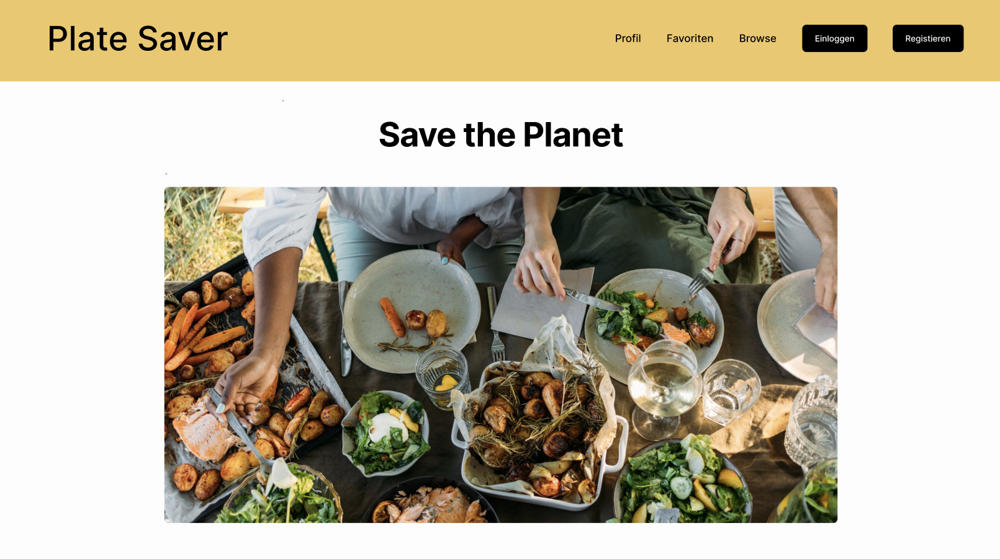
> Zu sehen ist die Startseite.

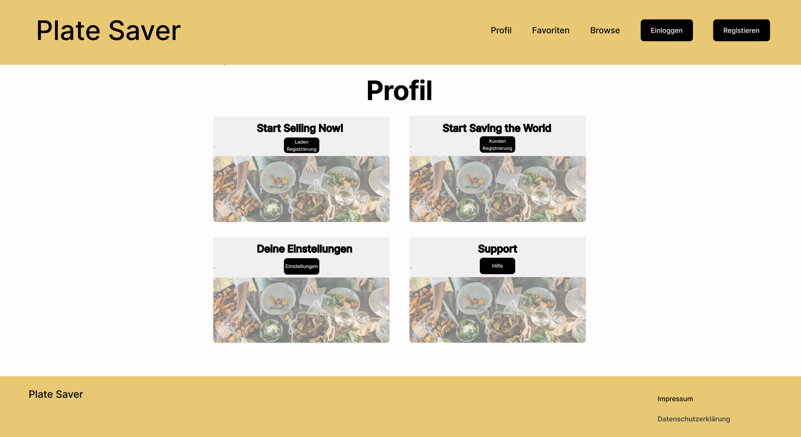
> Zu sehen ist die Profil-Seite. Hier wird der Profil eines Nicht-angemeldeten User angezeigt.

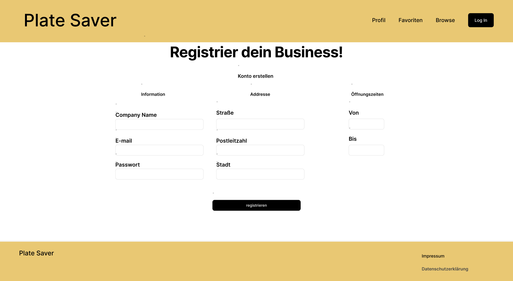
> Zu sehen ist die Registrierungsseite. Bevor ein User unsere Webseite vollumfänglich nutzen kann, muss er sich registrieren. Dies ist für das Bestellen und Kaufen unerlässlich.

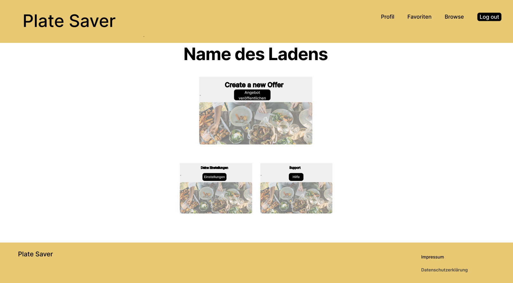
> Zu sehen ist die Profil-Seite nachdem eine Bäckerei sich eingeloggt hat.

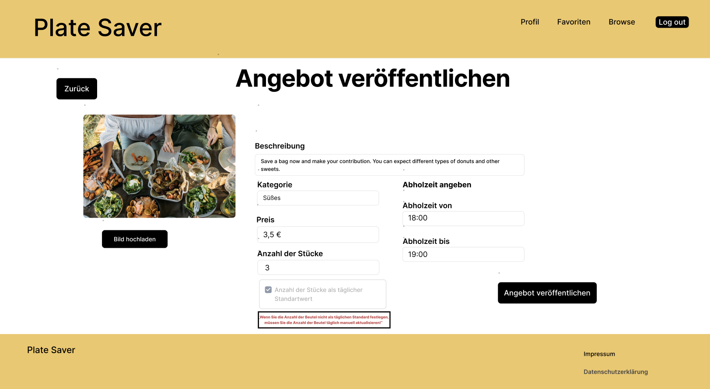
> Zu sehen ist die Seite, um Angebote zu veröffnetlichen.

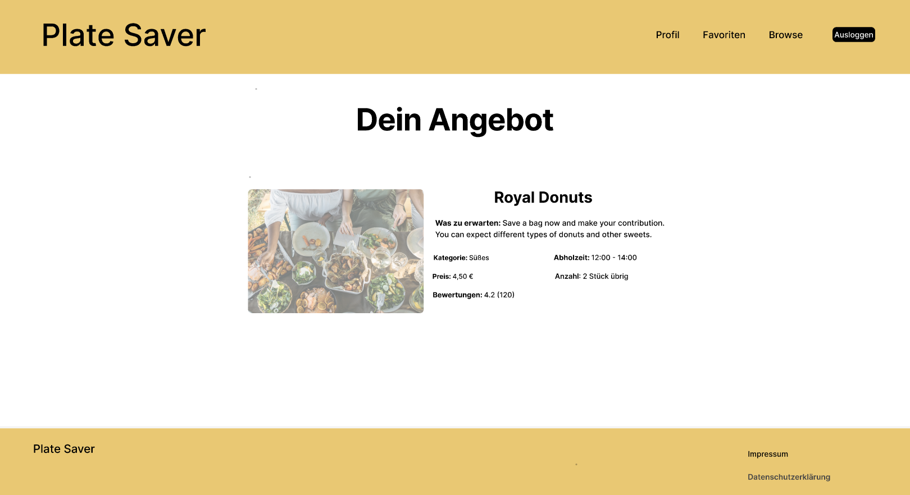
> Zu sehen ist die Seite, um Angebote detailiert darzustellen.

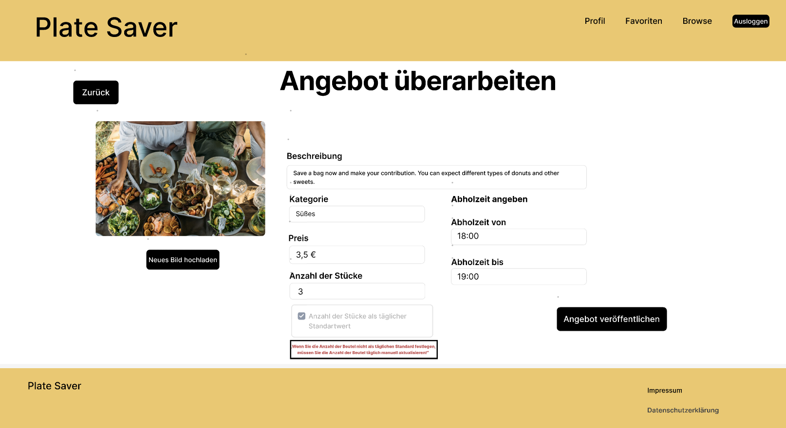
> Zu sehen ist die Seite, um Angebote zu überarbeiten.

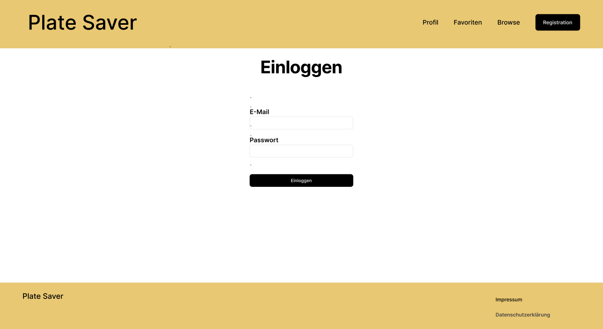
> Zu sehen ist die Login-Seite.

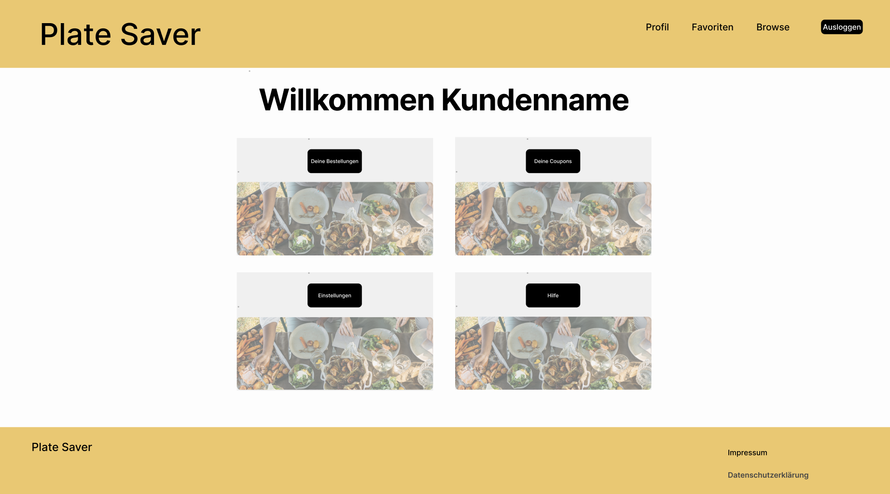
> Zu sehen ist die Profil-Seite nachdem ein Kunde sich eingeloggt hat.

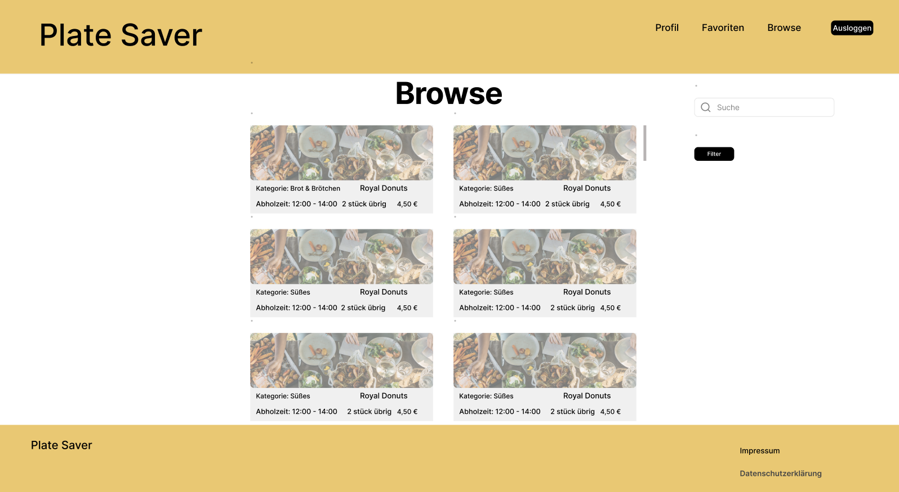
> Zu sehen sind die Browse-Seite, hier kann der Kunde nach Angeboten suchen und filtern.

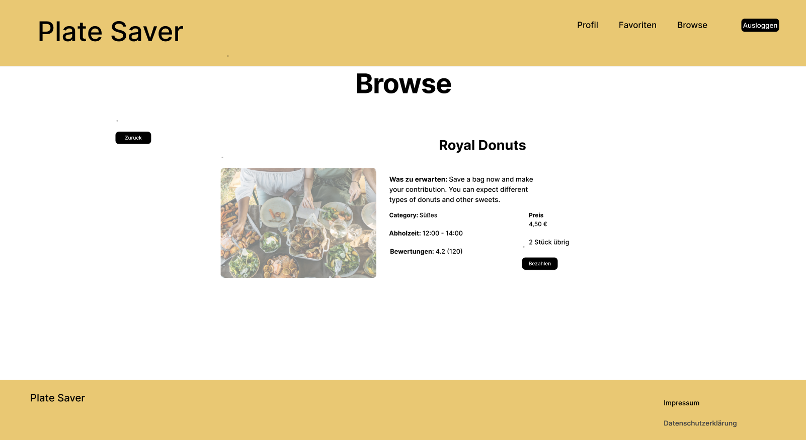
> Zu sehen ist die Seite, um Angebote detailiert darzustellen.

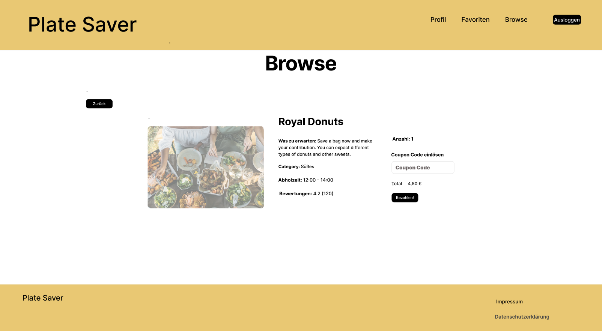
> Zu sehen ist die Seite, um einen Angebot zu kaufen.

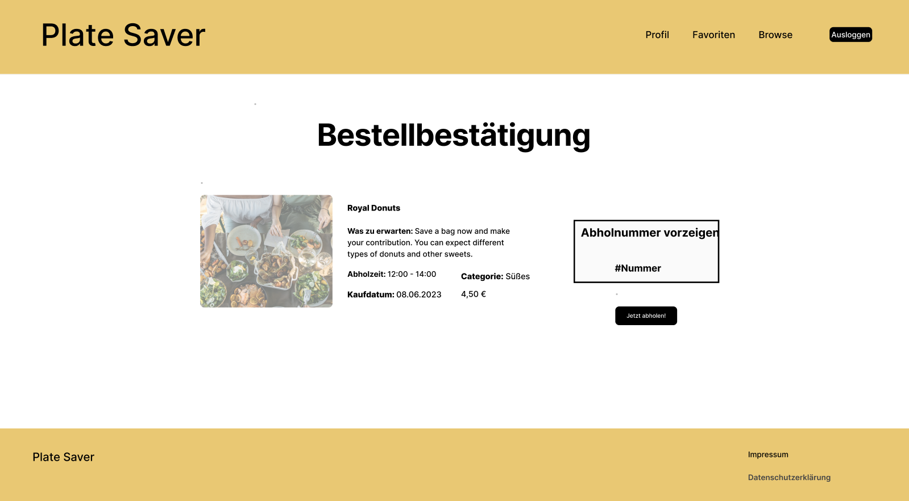
> Zu sehen ist die Seite, die alle nötigen Informationen zur Bestellung anzeigen.

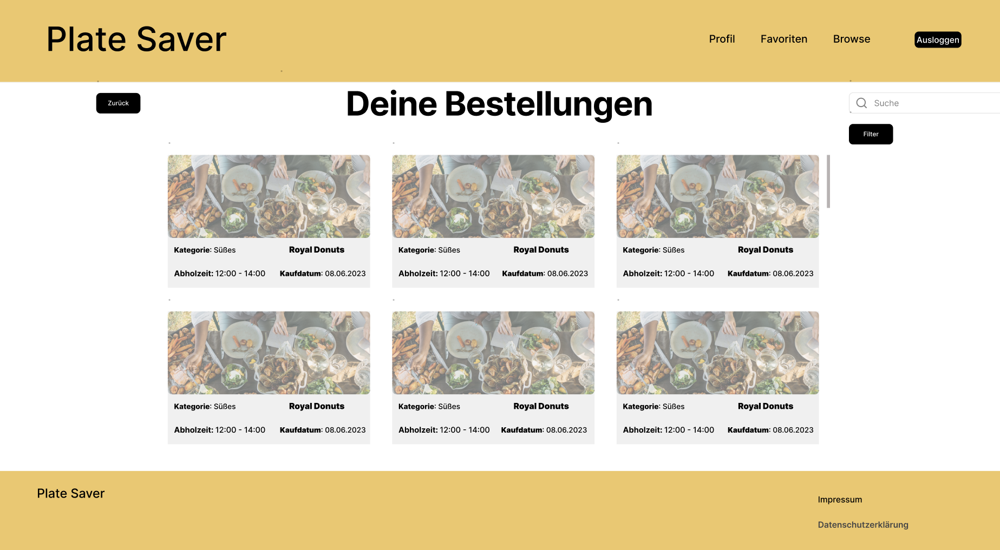
> Zu sehen ist die Bestellungen-Seite, hier sieht ein Kunde als seine Bestellungen

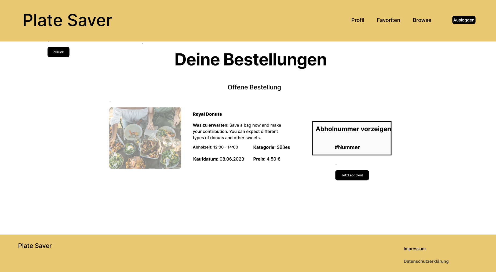
> Zu sehen ist die Seite, die alle nötigen Informationen zu einer offenen Bestellung anzeigen.

> Zu sehen ist die Bestellungen-Seite, hier sieht ein Kunde als seine Bestellungen

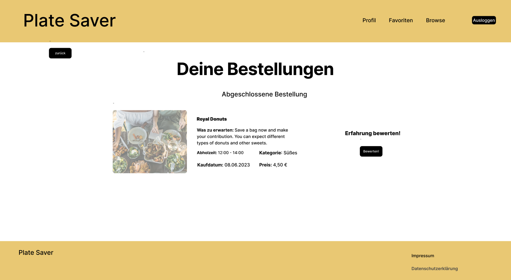
> Zu sehen ist die Seite, die alle nötigen Informationen zu einer abgeschlossenen Bestellung anzeigen, wo der Kunde seine Erfahrung bewerten kann.

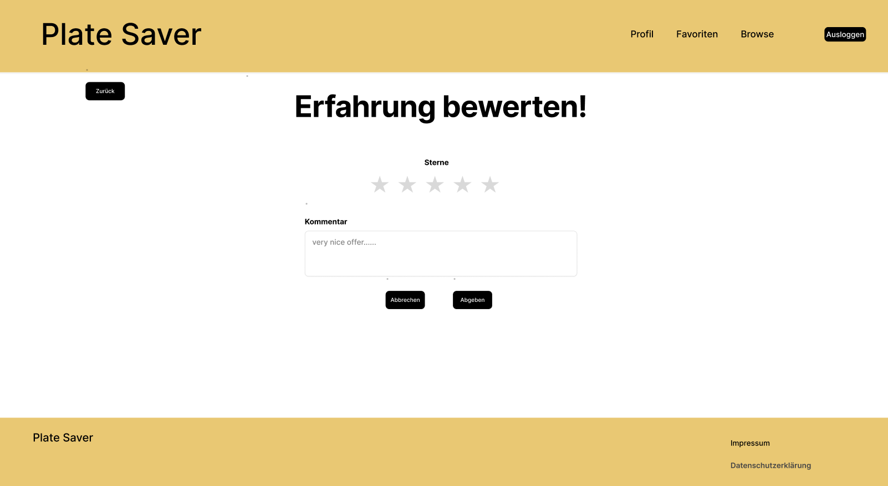
> Zu sehen ist die Seite, auf welcher der Kunde seine Bestellung bewerten kann.

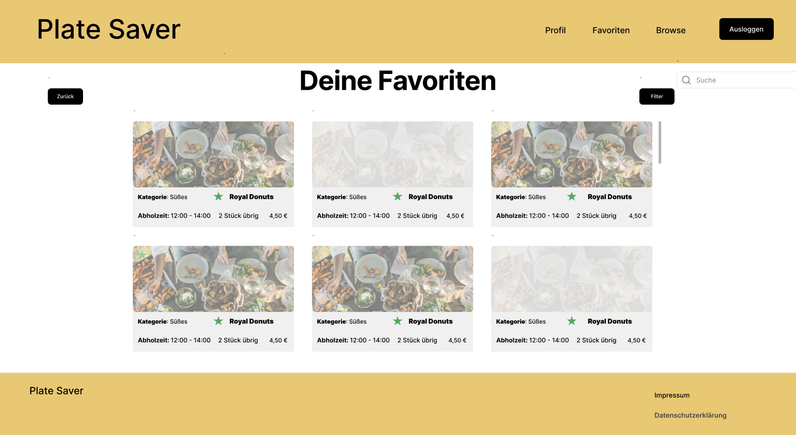
> Zu sehen ist die Seite, auf welcher die gespeicherten(favoriten) Angeboten des Kunden zu sehen sind.

